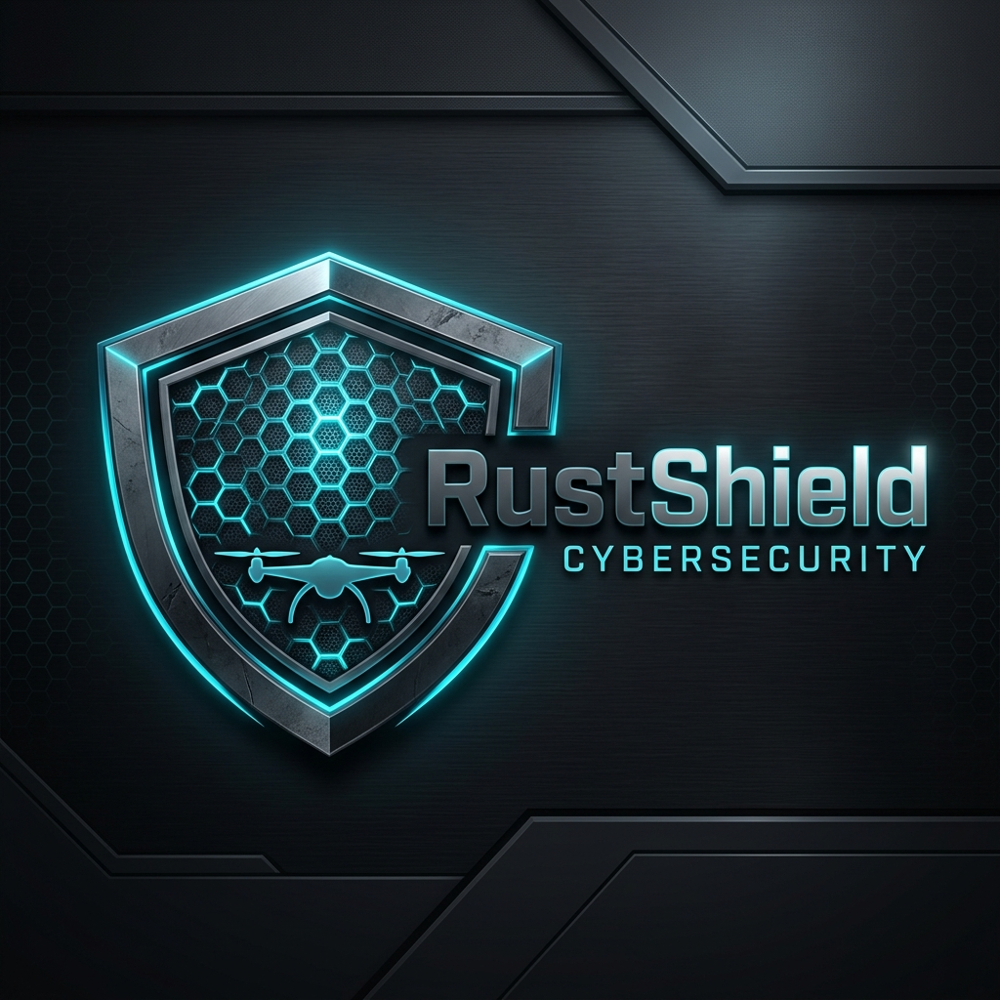

<div align="center">
  

  # RustShield Gateway
  ### Secure Communication Gateway for Industrial UAVs

  [](https://www.rust-lang.org/)
  [](#licencia)
  [](definicion/arquitectura-arc42-mavlink-rust-shield-gateway.md)
  [](#)

  **Protegiendo el cielo a través de la seguridad por diseño.**
</div>

---

## 🛡️ ¿Qué es RustShield Gateway?

**RustShield Gateway** es una solución de ciberseguridad industrial diseñada específicamente para proteger drones y vehículos no tripulados (UAVs) que utilizan el protocolo **MAVLink**. 

Actuando como una capa de inspección profunda y filtrado en tiempo real, el gateway se sitúa entre la Estación de Control de Tierra (GCS) y el vehículo, asegurando que solo los comandos autorizados, firmados y seguros lleguen al sistema de control de vuelo.

## 🚀 Pilares Tecnológicos

### 1. Seguridad de Memoria con Rust
Desarrollado íntegramente en **Rust**, RustShield elimina clases enteras de vulnerabilidades críticas como desbordamientos de búfer (buffer overflows) y condiciones de carrera, garantizando una estabilidad inigualable en entornos de misión crítica.

### 2. Arquitectura de Alta Disponibilidad (arc42)
El proyecto sigue rigurosamente el framework de arquitectura **arc42**, lo que permite una trazabilidad total desde los requisitos de seguridad hasta la implementación técnica. Esta estructura facilita la certificación bajo normativas industriales y de aviación.

### 3. Rendimiento Determinista
Diseñado para operaciones de baja latencia, el gateway procesa el tráfico MAVLink con un impacto mínimo en la telemetría, permitiendo una reacción inmediata ante amenazas sin comprometer la maniobrabilidad del vehículo.

---

## ✨ Características Principales

- **Deep Packet Inspection (DPI)**: Análisis en tiempo real de mensajes MAVLink 2.0.
- **Políticas de Vuelo Seguras**: Bloqueo automático de comandos críticos (ej. Armado) basado en el estado del vuelo y la identidad del operador.
- **Validación Criptográfica**: Soporte para MAVLink Signing y validación de integridad de mensajes.
- **Observabilidad Industrial**: Métricas en tiempo real y logs estructurados compatibles con SIEMs modernos.
- **Preparado para Certificación**: Documentación exhaustiva (PRD, Modelo de Amenazas, Matriz de Trazabilidad) lista para procesos de auditoría.

---

## 📂 Estructura del Proyecto

- [`src/`](src/): Implementación del core en Rust (Proxy UDP, Codec MAVLink, Filtros de Seguridad).
- [`definicion/`](definicion/): Documentación técnica detallada (Arquitectura arc42, Especificaciones, Planes de Validación).
- [`producto/`](producto/): Documentación estratégica (Roadmap, Dossier Comercial, Whitepapers).
- [`scripts/`](scripts/): Herramientas de utilidad para pruebas en entornos simulados (SITL).

---

## 🛠️ Inicio Rápido

### Requisitos
- Rust 1.75+
- Entorno Linux (Recomendado)

### Instalación
```bash
git clone https://github.com/RustShield-Security/rustshield-gateway.git
cd rustshield_gateway
cargo build --release
```

### Ejecución en Modo Simulación (SITL)
Para validar el gateway en un entorno controlado:
```bash
./scripts/run-sitl-gateway.sh
```

---

## 📘 Documentación Destacada

- [**Estrategia de Producto**](producto/roadmap-producto-v1.md): Hacia dónde se dirige RustShield.
- [**Arquitectura arc42**](definicion/arquitectura-arc42-mavlink-rust-shield-gateway.md): El corazón técnico del sistema.
- [**Modelo de Amenazas**](definicion/modelo-amenazas-mavlink-rust-shield-gateway.md): Análisis de vectores de ataque en UAVs.
- [**Políticas de Seguridad**](definicion/especificacion-politicas-seguridad.md): Definición de reglas de filtrado.

---

## ⚖️ Licencia

Este proyecto está bajo la licencia dual **MIT** y **Apache 2.0**. Consulte el archivo `LICENSE` (próximamente) para más detalles.

---

<div align="center">
  Desarrollado por <strong>RustShield Labs</strong>
  <br>
  <em>Cybersecurity for the next generation of autonomous systems.</em>
  <br>
  <a href="mailto:rustshield.security@proton.me">Contacto</a> • <a href="https://github.com/RustShield-Security">Organización</a>
</div>
