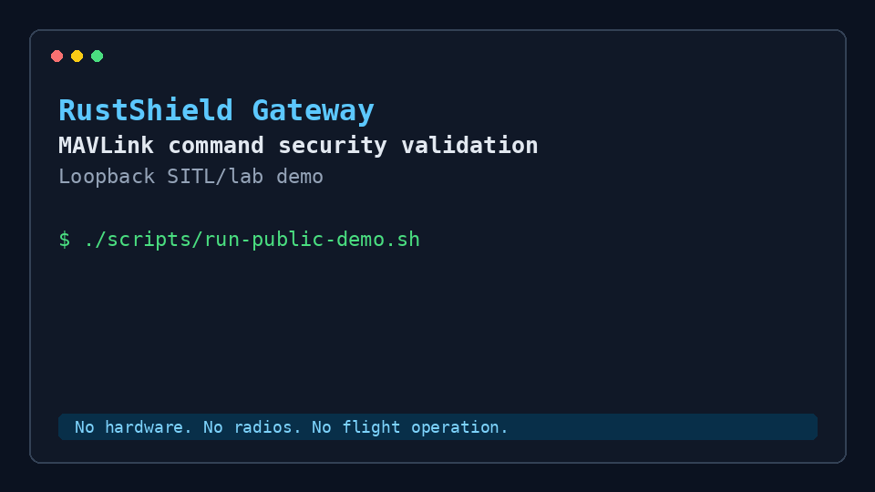

# RustShield Gateway

RustShield Gateway is a Rust-based MAVLink security validation gateway for
controlled SITL/laboratory workflows. It sits between a Ground Control Station
and a MAVLink vehicle or simulator, observes traffic, applies semantic command
policies, and produces logs, metrics and evidence for security review.

It is for UAV integrators, drone security labs, critical infrastructure
inspection teams, defense / dual-use R&D groups and academic robotics/security
labs that need a controlled way to study high-risk MAVLink command behavior.

Today, this repository can demonstrate a loopback lab flow:

```text
GCS/SITL traffic -> RustShield Gateway -> MAVLink policy decision -> logs, metrics and evidence
```

It does not claim certified flight safety, production readiness, real UAV flight
validation, complete MAVLink security coverage or replacement for autopilot
hardening.

## What It Does

RustShield evaluates selected high-risk MAVLink traffic using:

- semantic command policy for critical/high-risk MAVLink commands;
- conservative flight-state context from `HEARTBEAT`;
- MAVLink signing observe/audit/enforce laboratory paths;
- shadow enforcement for non-blocking impact assessment;
- read-only logs and metrics for evidence capture;
- reproducible local checks and public evidence summaries.

## Current Public Scope

- MAVLink UDP/SITL gateway.
- ArduPilot Copter SITL as the primary documented workflow.
- QGroundControl-oriented laboratory topology.
- Critical/high-risk MAVLink command policy.
- MAVLink signing observe/audit/enforce laboratory validation paths.
- Shadow enforcement counters and events.
- Read-only `/healthz` and `/metrics` observability.
- Public evidence summaries and reproducibility checks.
- Limited PX4 heartbeat fixtures and smoke tests, with PX4 modes treated
  conservatively as `Unknown`.
- Serial transport validated only against virtual PTY devices.

## Not Claimed

- No real UAV flight readiness.
- No certification.
- No hardware/radio validation.
- No production Serial/radio support.
- No complete PX4 mode-policy support.
- No complete MAVLink security coverage.
- No guaranteed end-to-end real-time performance.
- No replacement for platform hardening, key management or network
  segmentation.

## Quick Checks

```bash
cargo fmt --check
cargo clippy --all-targets --all-features -- -D warnings
cargo test
```

Supply-chain checks used by the project:

```bash
cargo audit
cargo deny check
```

## Public Lab Demo

The public demo is loopback-only and does not require real hardware, radios,
QGroundControl or an autopilot.



[MP4 version](docs/assets/rustshield-demo.mp4)

```bash
./scripts/run-public-demo.sh
```

The demo flow is:

```text
GCS/SITL traffic
  -> RustShield Gateway
  -> MAVLink parser and flight-state context
  -> semantic command policy decision
  -> structured logs, read-only metrics and evidence summary
```

See [docs/demo.md](docs/demo.md).

## Evidence

See [docs/evidence/latest/](docs/evidence/latest/) for public, sanitized
evidence summaries.

The public evidence pack is a summary. It is not a certification package and it
does not include private laboratory history, raw internal logs or customer
material.

## Commercial / Lab Pilots

See [COMMERCIAL.md](COMMERCIAL.md) for assessment, laboratory pilot and partner
integration options.

## Documentation

- [Who Is This For?](docs/who-is-this-for.md)
- [Commercial Pilot Package](docs/commercial-pilot-package.md)
- [Market Positioning](docs/market-positioning.md)
- [Use Cases](docs/use-cases/README.md)
- [GitHub Visibility Checklist](docs/github-visibility-checklist.md)
- [Proposed GitHub Issues](docs/proposed-github-issues.md)
- [Public Scope](docs/public-scope.md)
- [Public Claims](docs/claims.md)
- [Limitations](docs/limitations.md)
- [Responsible Use](docs/responsible-use.md)
- [Demo](docs/demo.md)
- [Evidence Summary](docs/evidence-summary.md)
- [Public Roadmap](docs/public-roadmap.md)
- [Product Brief](docs/product-brief.md)
- [Assessment Offer](docs/assessment-offer.md)
- [Architecture Summary](docs/architecture-summary.md)
- [Threat Model Summary](docs/threat-model-summary.md)
- [Policy Catalog Summary](docs/policy-catalog-summary.md)
- [Signing Lab Summary](docs/signing-lab-summary.md)
- [Observability Summary](docs/observability-summary.md)

## Security

Please read [SECURITY.md](SECURITY.md) before reporting vulnerabilities or using
the project in a lab.

## License

Licensed under either of:

- Apache License, Version 2.0 ([LICENSE-APACHE](LICENSE-APACHE))
- MIT License ([LICENSE-MIT](LICENSE-MIT))

at your option.
