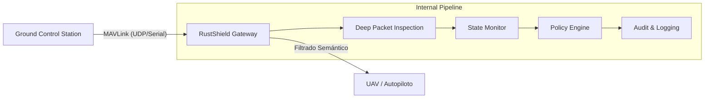

<div align="center">
  

  # RustShield Gateway
  ### The First Semantic Cybersecurity Shield for Autonomous UAVs

  [](https://www.rust-lang.org/)
  [](definicion/arquitectura-arc42-mavlink-rust-shield-gateway.md)
  [](https://www.rust-lang.org/policies/safety)
  [](#licencia)

  **Protegiendo activos críticos en el espacio aéreo mediante seguridad determinista y arquitecturas verificables.**
</div>

---

## 🛡️ La Misión: Cerrar la Brecha de Seguridad en C2

Los protocolos de comunicación en UAVs y robótica (MAVLink, ROS, Modbus) fueron diseñados para la eficiencia, descuidando la seguridad. Actualmente, una inyección de comandos no autorizada puede resultar en la pérdida catastrófica de activos.

**RustShield Gateway** soluciona esto sin necesidad de recertificar o actualizar costosos firmwares de vuelo. Actúa como un **Escudo Semántico Transparente** que entiende el contexto de la misión y bloquea amenazas en microsegundos.

---

## 🚀 Innovaciones Clave

### 🧠 Filtrado Semántico (Stateful Shielding)
A diferencia de los firewalls tradicionales, RustShield mantiene un **gemelo digital del estado de vuelo** (`FlightState`). Si un comando de "Desarmado" llega mientras el dron está en "Modo Automático" y a 100 metros de altura, el Shield lo bloquea instantáneamente como una operación incoherente y peligrosa.

### 🦀 Rendimiento con Garantías de Rust
- **Zero-Copy Parsing**: Procesamiento ultrarrápido de paquetes MAVLink 2.0.
- **Memory Safety**: Eliminación total de desbordamientos de búfer y condiciones de carrera.
- **Latencia Sub-ms**: Procesamiento interno medio en **60µs**, garantizando que el control de vuelo no se vea afectado.

### 📋 Ready for Certification (arc42)
El Gateway no es una "caja negra". Ha sido diseñado bajo el estándar **arc42**, proporcionando una trazabilidad completa:
- **ADRs (Architecture Decision Records)**: Cada decisión de diseño está documentada y justificada.
- **Threat Model**: Análisis exhaustivo de vectores de ataque.
- **Evidence Packs**: Documentación lista para procesos de auditoría y *assurance*.

---

## 📊 Arquitectura del Sistema



---

## ✨ Características Técnicas

| Característica | Beneficio |
| :--- | :--- |
| **DPI (Deep Packet Inspection)** | Inspección profunda de mensajes `COMMAND_LONG` y `COMMAND_INT`. |
| **Criptografía AEAD** | Soporte para ChaCha20-Poly1305 en flujos de datos sensibles. |
| **Fuzzing-Tested** | Validado contra ataques de red mediante campañas de fuzzing intensivas. |
| **Observabilidad Industrial** | Métricas en tiempo real vía endpoint Prometheus/Healthz. |
| **Agnóstico al Hardware** | Compatible con ArduPilot, PX4 y cualquier sistema basado en MAVLink. |

---

## 🛠️ Laboratorio de Validación (SITL)

El proyecto incluye un entorno de validación automatizado para investigadores y operadores:

```bash
# Iniciar el Gateway en modo simulación
./scripts/run-sitl-gateway.sh

# Simular un ataque de inyección de comando de armado no autorizado
./scripts/send-sitl-arm-command.sh 127.0.0.1:14551
```

---

## 📂 Ecosistema de Documentación

Hemos estructurado el conocimiento para diferentes perfiles de interés:

- **Para Inversores/Partners**: [Dossier Comercial (One-Pager)](producto/dossier-comercial-one-pager.md) y [Roadmap de Producto](producto/roadmap-producto-v1.md).
- **Para Ingenieros**: [Especificación de Políticas](definicion/especificacion-politicas-seguridad.md) y [Estrategia Criptográfica](definicion/estrategia-gestion-claves.md).
- **Para Auditores**: [Matriz de Trazabilidad](definicion/trazabilidad-mvp-0.1.md) y [Arquitectura arc42](definicion/arquitectura-arc42-mavlink-rust-shield-gateway.md).

---

## ⚖️ Licencia

Declarado bajo licencia dual **MIT** o **Apache-2.0**, permitiendo su integración tanto en proyectos Open Source como en ecosistemas industriales cerrados.

---

<div align="center">
  <strong>RustShield Labs</strong><br>
  <em>Cybersecurity for the next generation of autonomous systems.</em><br>
  <a href="mailto:rustshield.security@proton.me">Contacto</a> • <a href="https://github.com/RustShield-Security">GitHub Organization</a>
</div>
